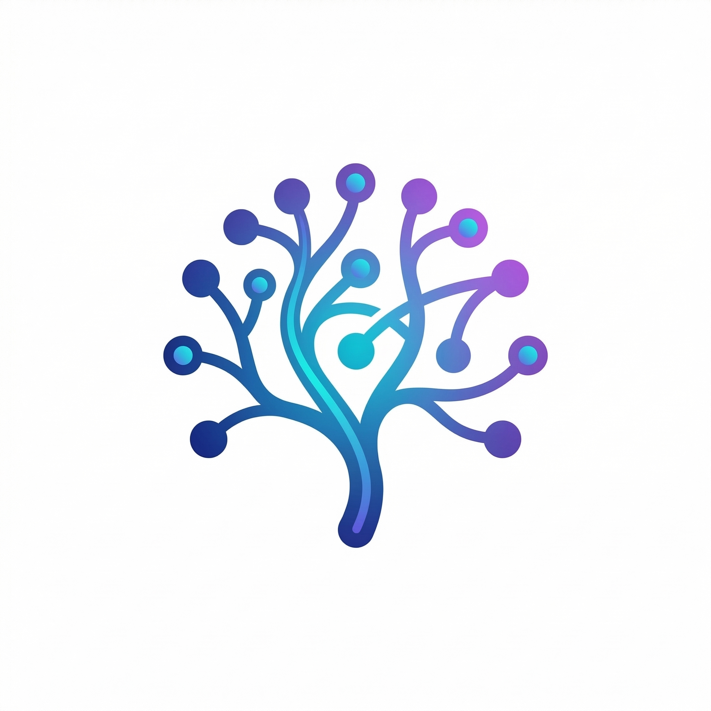

# Axon

<p align="center">
  
  <br/>
  <em>Your personal knowledge base and memory engine.</em>
  <br/>
  <em>Local-first · Single binary · Relationship-aware · AI-ready</em>
</p>

<p align="center">
  <a href="https://github.com/hsiaosiyuan0/axon/actions/workflows/ci.yml"></a>
  <a href="https://github.com/hsiaosiyuan0/axon/actions/workflows/release.yml"></a>
  <a href="LICENSE"></a>
  <a href="https://go.dev"></a>
</p>

---

Axon is a CLI tool that turns your documents, notes, web pages, and code snippets into a **searchable, relationship-aware knowledge graph** — all stored locally in a single SQLite file.

```
axon add meeting-notes.md          # ingest a document
axon add https://go.dev/blog/...   # ingest a URL
axon add paper.pdf -c research     # ingest a PDF into "research" collection
axon query "API design patterns"   # hybrid BM25 + vector search
axon tui                           # interactive TUI
axon serve                         # start HTTP API + Web UI
axon mcp                           # MCP server for Claude Desktop
```

---

## Features

### 🧠 Knowledge & Search
- **Hybrid Search** — BM25 full-text + vector embeddings, fused with Reciprocal Rank Fusion (RRF) for best-of-both-worlds retrieval
- **Knowledge Graph** — Auto-detects `[[wikilinks]]`, semantic similarity, and LLM-extracted relations (ref, cite, similar, parent/child)
- **Collections** — Organize knowledge into typed groups (notes, research, code, diary…) with tailored chunking strategies

### 📥 Ingestion
- **Multi-format** — Markdown, URLs, PDFs, Obsidian vaults, Notion exports, code snippets
- **Watch mode** — Auto-ingests file changes in the background, always up to date

### 🤖 AI Integration
- **AI-ready** — MCP server for Claude Desktop & Cursor; exposes `memory_query`, `memory_add`, `memory_relate` tools
- **LLM assistance** — Optional auto-classification, relation extraction, and smart reranking — fully usable offline without them

### 🖥️ Interfaces
- **Web UI** — Built-in D3.js knowledge graph explorer (`axon serve` → `/ui`)
- **TUI** — Real-time interactive search in the terminal (`axon tui`)
- **REST API** — Full HTTP API for custom integrations

### 🔒 Privacy & Portability
- **Local-first** — All data stays in `~/.axon/axon.db` — no cloud, no telemetry
- **Single binary** — Download and run — zero external dependencies
- **Multi-vault** — Use `--db` to switch between multiple knowledge bases

---

## Quick Start

```bash
axon init
axon collection new
axon add README.md
axon add https://news.ycombinator.com -c tech
axon query "machine learning"
axon serve        # → http://localhost:7474/ui
```

---

## Documentation

- [Installation](docs/installation.md)
- [Usage](docs/usage.md) — commands, search, collections, export, watch mode
- [Integrations](docs/integrations.md) — Claude Desktop (MCP), HTTP REST API
- [Configuration](docs/configuration.md) — env vars, embedding models, LLM setup
- [Development](docs/development.md) — build, project structure, roadmap
- [Architecture](docs/architecture.md) — technical deep-dive

---

## License

MIT — see [LICENSE](LICENSE)

---

## Contributing

Issues and PRs welcome at [github.com/hsiaosiyuan0/axon](https://github.com/hsiaosiyuan0/axon)

> "Every connection matters, every memory counts."
